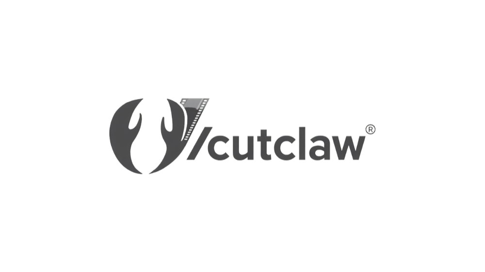

<div align="center">

<picture>
  <source media="(prefers-color-scheme: dark)" srcset="asset/CutClaw.png" />
  <source media="(prefers-color-scheme: light)" srcset="asset/CutClaw.png" />
  
</picture>

## 🦞 vcutclaw：面向批量长视频的多智能体协作音乐同步剪辑系统

**🎬 你的个人剪辑师——将数个素材一键打造成电影级蒙太奇。**

[](https://arxiv.org/abs/2603.29664)
[](https://github.com/treesan/vcutclaw)

<p align="center">
  
  
  
  
  
</p>

<p>
  <a href="readme.md"></a>
    <a href="readme_zh.md"></a>
</p>

[概述](#-概述) • [路线图](#-路线图) • [核心功能](#-核心功能) • [效果展示](#️-效果展示) • [快速开始](#-快速开始) • [CLI 速查](#-cli-速查) • [常见问题](#️-常见问题) • [引用](#-引用) • [Star History](#-star-history)

</div>

---

## 💡 概述

vcutclaw 是一个面向长视频素材与音乐的端到端自动剪辑系统。

它首先将原始视频和音频解析为结构化描述，再通过多智能体流水线完成镜头规划（`shot_plan`）、片段时间戳选取（`shot_point`）及质量验证，最终渲染输出成片。


---

## 🗺️ 路线图

### 短期目标

> 我们正在优先推进更快、更省、更具表现力的视频剪辑能力。

- [ ] 🧩 **集成 ARC-Chapter**  
  引入 [ARC-Chapter](https://github.com/TencentARC/ARC-Chapter)，进一步降低长视频素材拆解的成本。
- [ ] 💸 **低成本模式**  
  增加预算友好的低成本模式，不再对全部素材做完整处理，而是主动读取更相关的素材片段。

### 长期目标

> 这些方向会帮助 vcutclaw 走向更完整的产品形态和更广泛的生态适配。

- [ ] 🎯 **素材偏好指定系统**  
  允许用户在生成分镜方案时指定素材偏好：某些片段多保留镜头、指定时间段（如 DSC_8324 的 2-5s 多保留）、指定人物或风景多保留镜头。Web 后管页面支持多视频选择 + 可视化时间段编辑器。
- [ ] 📱 **剪映/CapCut 草稿导出**  
  从 vcutclaw 的 shot_plan/shot_point 生成剪映专业版草稿项目，支持用户在专业 NLE 中进一步精修。基于 [jianying-editor-skill](https://github.com) API 实现草稿创建、素材导入、时间线组装。
- [ ] 🌐 **建立在线服务页面**  
  构建网页化在线服务界面，降低使用门槛并提升部署便利性。

---

## ✨ 核心功能

<table align="center" width="100%" style="border: none; table-layout: fixed;">
<tr>
<td width="25%" align="center" style="vertical-align: top; padding: 16px;">

### 🎬 **一键素材解析**


只需一键，即可将数小时的原始视频和音频转化为结构化、可检索的素材库。

</td>
<td width="25%" align="center" style="vertical-align: top; padding: 16px;">

### 🎯 **自然语言指令控制**


只需一句文字指令即可主导剪辑风格——既能生成快节奏人物混剪，也能输出慢节奏情感叙事。

</td>
<td width="25%" align="center" style="vertical-align: top; padding: 16px;">

### 📱 **智能自动裁剪**


内容感知裁剪自动识别画面主体，并按各平台比例进行智能调整。

</td>
<td width="25%" align="center" style="vertical-align: top; padding: 16px;">

### 🎵 **音乐感知同步**


提取音乐节拍与能量信号，构建与音乐节奏完美契合的剪切点。

</td>
</tr>
</table>

---


## 🖼️ 效果展示
……

----

## 🚀 快速开始

### 1. 安装

```bash
git clone https://github.com/treesan/vcutclaw.git
cd vcutclaw
conda create -n CutClaw python=3.12
conda activate CutClaw
pip install -r requirements.txt
```

> 强烈推荐使用支持 GPU 加速的 Decord/NVDEC 版本以加快视频解码速度，请参考[源码编译指南](https://github.com/dmlc/decord?tab=readme-ov-file#install-from-source)。

### 2. 放入素材文件

```
resource/
├── video/      ← 放入 .mp4 / .mkv 视频文件
├── audio/      ← 放入 .mp3 / .wav 音频文件
└── subtitle/   ← 可选 .srt 字幕文件（跳过 ASR，节省时间）
```

### 3. 运行

**UI 界面（推荐）**

```bash
streamlit run app.py
```

在浏览器中打开 `http://localhost:8501`。（如无法访问，请尝试 `http://127.0.0.1:8501`）


> 将素材放入上述路径后，可直接在 UI 中选择对应文件。

模型选择建议：

- **视频模型**
  - **用途**：镜头/场景理解与视觉描述生成。
  - **推荐**：Gemini-3、Qwen3.5、GPT-5.3

- **音频模型**
  - **用途**：语音识别（ASR）及音乐结构分析（节拍/强拍、音高、能量），用于节拍感知分割。
  - **推荐**：Gemini-3

- **智能体模型**
  - **用途**：驱动编剧 + 剪辑 + 审阅智能体循环，生成 `shot_plan` 和 `shot_point`。
  - **推荐**：MiniMax-2.7、Kimi-2.5、Claude-4.5

系统使用 `LiteLLM` 作为 API 统一网关，模型名称格式如 `openai/MiniMax-2.7`，表示通过 OpenAI 协议调用该模型。更多信息请参阅 [LiteLLM 文档](https://github.com/BerriAI/litellm)。


<details>
<summary><strong>命令行模式（进阶）</strong></summary>

```bash
python local_run.py \
  --Video_Path "resource/video/xxxx.mp4" \
  --Audio_Path "resource/audio/xxxx.mp3" \
  --Instruction "xxxx"
```

<details>
<summary>常用配置覆盖参数</summary>

所有 `src/config.py` 中的参数均可通过 `--config.PARAM_NAME VALUE` 在运行时覆盖。

| 参数 | 默认值 | 说明 |
|---|---|---|
| `VIDEO_PATH` | `"resource/video/The_Dark_Knight.mkv"` | 默认视频路径（UI 记忆输入） |
| `AUDIO_PATH` | `"resource/audio/Way_Down_We_Go.mp3"` | 默认音频路径（UI 记忆输入） |
| `INSTRUCTION` | `"Joker's crazy that want to change the world."` | 默认剪辑指令 |
| `ASR_BACKEND` | `"litellm"` | ASR 引擎（`litellm` 云端或 `whisper_cpp` 本地） |
| `VIDEO_FPS` | `2` | 预处理采样帧率 |
| `MAIN_CHARACTER_NAME` | `"Joker"` | 主角名称（角色聚焦剪辑） |
| `AUDIO_MIN_SEGMENT_DURATION` | `3.0` | 节拍片段最短时长（秒） |
| `AUDIO_MAX_SEGMENT_DURATION` | `5.0` | 节拍片段最长时长（秒） |
| `AUDIO_DETECTION_METHODS` | `["downbeat", "pitch", "mel_energy"]` | 音频关键点检测方法 |
| `PARALLEL_SHOT_MAX_WORKERS` | `4` | 并行镜头选择线程数 |

示例：

```bash
python local_run.py \
  --Video_Path "resource/video/xxxx.mp4" \
  --Audio_Path "resource/audio/xxxx.mp3" \
  --Instruction "xxxx" \
  --config.MAIN_CHARACTER_NAME "Batman" \
  --config.VIDEO_FPS 2 \
  --config.AUDIO_TOTAL_SHOTS 50
```

</details>

手动渲染：

```bash
python render/render_video.py \
  --shot-plan  "Output/<video_audio>/shot_plan_*.json" \
  --shot-json  "Output/<video_audio>/shot_point_*.json" \
  --video  "resource/video/xxxx.mp4" \
  --audio  "resource/audio/xxxx.mp3" \
  --output "output/final.mp4" \
  --crop-ratio "9:16" \
  --no-labels --render-hook-dialogue
```

</details>

---

## 🚀 CLI 速查

所有命令必须在 vcutclaw 项目目录下，并激活正确的 conda 环境后执行：

```bash
cd vcutclaw
conda activate CutClaw
```

### 1. 视频素材解析（Video Preprocessing）

在 BGM 未到位时，先跑视频解析：

```bash
python local_run.py \
  --Video_Path "resource/video/素材名.MOV" \
  --Instruction "仅做视频解析" \
  --type vlog \
  --preprocess-only
```

**产出：** `Output/Video/{素材ID}/captions/scene_summaries_video/` + `shot_scenes.txt`

### 2. BGM 节奏分析

锦书下载 BGM 后，先跑节奏分析：

```bash
python -c "
from src.audio.audio_caption_madmom import caption_audio_with_madmom_segments

caption_audio_with_madmom_segments(
    audio_path='resource/audio/bgm.mp3',
    output_path='Output/Audio/{BGM_ID}/captions/captions.json',
)
"
```

> ⚠️ 该文件不支持 `--audio`/`--output` CLI 参数，必须用上面的 Python 内联方式调用。

**产出：** `Output/Audio/{BGM_ID}/captions/captions.json`（BPM、结构分段、关键点时间戳）

### 3. 视频 + BGM 联合解析

BGM 已到位时，一次性跑全解析：

```bash
python local_run.py \
  --Video_Path "resource/video/素材名.MOV" \
  --Audio_Path "resource/audio/bgm.mp3" \
  --Instruction "仅做解析" \
  --type vlog \
  --preprocess-only
```

### 4. BGM 下载（Pixabay）

使用 Pixabay 搜索下载免费商用 BGM（无需 API Key）：

```bash
# 搜索
python3 ~/.openclaw/skills/pixabay-music-skill/scripts/pixabay_music.py \
  search "upbeat travel vlog" --max-duration 120

# 下载
python3 ~/.openclaw/skills/pixabay-music-skill/scripts/pixabay_music.py \
  download "upbeat travel vlog" \
  -o vcutclaw/resource/audio/bgm.mp3
```

### 5. 生成 Shot Plan（分镜方案）

基于场景分析 + BGM 结构，内容策略者（锦书）生成 shot_plan：

```bash
python src/planner_agent.py \
  --video "resource/video/素材名.MOV" \
  --scene-summaries "Output/Video/{素材ID}/captions/scene_summaries_video" \
  --audio-captions "Output/Audio/{BGM_ID}/captions/captions.json" \
  --subtitle "Output/Video/{素材ID}/subtitles_with_characters.srt" \
  --bgm-name "bgm.mp3" \
  --output-dir "Output/Output/{素材ID}_{BGM_ID}" \
  --strategy "前4秒快切，中间6秒温馨互动，后5秒情感高潮" \
  --action shot_plan
```

### 6. 生成 Shot Point（剪辑点）

基于已确认的 shot_plan，生成精确的镜头入点出点：

```bash
python src/short_video_editor.py \
  --video "resource/video/素材名.MOV" \
  --shot-plan "Output/Output/{素材ID}_{BGM_ID}/shot_plan_xxx.json" \
  --scene-summaries "Output/Video/{素材ID}/captions/scene_summaries_video" \
  --audio-captions "Output/Audio/{BGM_ID}/captions/captions.json" \
  --scene-cuts "Output/Video/{素材ID}/frames/shot_scenes.txt" \
  --instruction "温馨家庭出行，15秒卡点短片" \
  --shot-point-context "优先保留孩子大笑的镜头" \
  --action shot_point
```

### 7. 预览 Shot Point（dry-run）

不渲染，预览 shot_point 分配效果供确认：

```bash
python src/short_video_editor.py ... --action dry_run
```

### 8. 渲染成片

确认后执行最终渲染：

```bash
python src/short_video_editor.py \
  --video "resource/video/素材名.MOV" \
  --shot-plan "Output/Output/{素材ID}_{BGM_ID}/shot_plan_xxx.json" \
  --scene-summaries "Output/Video/{素材ID}/captions/scene_summaries_video" \
  --audio-captions "Output/Audio/{BGM_ID}/captions/captions.json" \
  --action render
```

或直接调用渲染脚本：

```bash
python render/render_video.py \
  --shot-json "Output/.../shot_point_xxx.json" \
  --shot-plan "Output/.../shot_plan_xxx.json" \
  --video "resource/video/素材名.MOV" \
  --audio "resource/audio/bgm.mp3" \
  --output "Output/Output/素材名/output_9x16.mp4" \
  --crop-ratio "9:16" \
  --no-labels \
  --render-hook-dialogue
```

### 9. 批量剪辑（多片段项目）

当项目包含多个源视频（如一次旅行有 40+ 个大疆航拍片段）时，使用 `--project` 命令进行完整的批量剪辑流程。

**Step 1 — 从视频目录创建项目：**

```bash
python local_run.py --project create \
  --video-dir "/path/to/your/videos" \
  --project-name "我的旅行"
```

扫描目录中所有 `.mp4`/`.mov` 文件，通过 ffprobe 提取元数据，并按录制日期自动分组。

**Step 2 — 审查源素材一致性：**

```bash
python local_run.py --project review-sources \
  --project-path "Output/Projects/<项目ID>/project.json"
```

检查所有片段的编码、分辨率、帧率和色彩空间一致性，标记问题并报告渲染时是否需要归一化。

**Step 3 — 批量预处理所有片段：**

```bash
python local_run.py --project preprocess \
  --project-path "Output/Projects/<项目ID>/project.json" \
  --type vlog \
  --max-workers 2
```

并行对每个片段执行镜头检测、描述生成、场景合并和场景分析。支持断点续跑——中断后重新执行相同命令会自动跳过已完成的片段。

**Step 4 — 构建全局素材索引：**

```bash
python local_run.py --project build-index \
  --project-path "Output/Projects/<项目ID>/project.json"
```

将所有片段的场景描述汇总为扁平化的 `material_index.json`，供策划智能体在整个项目范围内选片。

**Step 5 — 生成分镜方案（自动 BGM 节奏分析）：**

```bash
python local_run.py --project plan \
  --project-path "Output/Projects/<项目ID>/project.json" \
  --profile bilibili_1080p \
  --strategy "壮阔航拍配合电影感转场"
```

策划智能体自动分析 BGM（madmom 关键点检测 + LLM 段落/子段落描述），从素材索引中选场景，生成跨片段分镜方案。BGM 分析结果缓存到 `bgm_captions/` 目录。

**Step 6 — 生成剪辑点（精确时间戳）：**

```bash
python local_run.py --project edit \
  --project-path "Output/Projects/<项目ID>/project.json" \
  --profile bilibili_1080p
```

读取分镜方案，按源片段分组，对每个片段调用 DirectShotSelector（LLM）生成精确入点出点。输出 `shot_point_<profile>.json`，每个 shot 包含 `clip_file_path` 标识来源文件。

**Step 7 — 渲染成片：**

```bash
python local_run.py --project render \
  --project-path "Output/Projects/<项目ID>/project.json" \
  --profile bilibili_1080p \
  --extract-timeout 600
```

多源渲染器：验证 → 提取 → 拼接 → BGM 混合 → 字幕叠加 → 结尾视频。自动从 `shot_points/` 目录发现 shot_point 文件。支持 `--with-ending`、`--ending-path`、`--ending-duration`、`--ending-fade` 追加结尾片段。

**随时查看项目状态：**

```bash
python local_run.py --project status \
  --project-path "Output/Projects/<项目ID>/project.json"
```

**批量流程一键执行：**

```bash
PROJECT="Output/Projects/我的旅行/project.json"
python local_run.py --project create --video-dir "/视频目录" --project-name "我的旅行"
python local_run.py --project review-sources --project-path "$PROJECT"
python local_run.py --project preprocess --project-path "$PROJECT" --type vlog --max-workers 2
python local_run.py --project build-index --project-path "$PROJECT"
python local_run.py --project plan --project-path "$PROJECT" --profile bilibili_1080p --strategy "旅行 vlog"
python local_run.py --project edit --project-path "$PROJECT" --profile bilibili_1080p
python local_run.py --project render --project-path "$PROJECT" --profile bilibili_1080p
```

### 10. 常用配置覆盖

运行时覆盖 `src/config.py` 中的参数：

```bash
python local_run.py ... \
  --config.VIDEO_FPS 2 \
  --config.AUDIO_TOTAL_SHOTS 50 \
  --config.MAIN_CHARACTER_NAME "Tree" \
  --config.MIN_PROTAGONIST_RATIO 0.7 \
  --config.AUDIO_MIN_SEGMENT_DURATION 1.8 \
  --config.AUDIO_MAX_SEGMENT_DURATION 3.8
```

### 产出文件一览

| 操作 | 产出路径 | 说明 |
|------|---------|------|
| 视频解析 | `Output/Video/{ID}/captions/scene_summaries_video/` | 逐场景描述 |
| 场景切分 | `Output/Video/{ID}/frames/shot_scenes.txt` | 镜头边界时间 |
| BGM 分析 | `Output/Audio/{ID}/captions/captions.json` | 节奏结构 + 每段 caption |
| ASR 字幕 | `Output/Video/{ID}/subtitles.srt` | 语音转文字 |
| Shot Plan | `Output/Output/{ID}/{BGM}/shot_plan_xxx.json` | 创意方案 |
| Shot Point | `Output/Output/{ID}/{BGM}/shot_point_xxx.json` | 精确时间戳 |
| 成片 | `Output/Output/{ID}/{BGM}/output_9x16.mp4` | 渲染视频 |

#### 批量剪辑产出

| 操作 | 产出路径 | 说明 |
|------|---------|------|
| 项目 | `Output/Projects/{ID}/project.json` | 项目元数据 + 片段列表 |
| 源素材审查 | `Output/Projects/{ID}/source_review.json` | 编码/分辨率/帧率审计 |
| 片段预处理 | `Output/Projects/{ID}/Clips/{clip_id}/` | 逐片段场景分析 |
| 断点 | `Output/Projects/{ID}/checkpoints/` | 可续跑的阶段状态 |
| 素材索引 | `Output/Projects/{ID}/material_index.json` | 供策划使用的全局场景索引 |
| BGM 分析 | `Output/Projects/{ID}/bgm_captions/` | 自动生成的 BGM 节奏分析 |
| 分镜方案 | `Output/Projects/{ID}/shot_plans/shot_plan_<profile>.json` | 跨片段创意分镜 |
| 剪辑点 | `Output/Projects/{ID}/shot_points/shot_point_<profile>.json` | 含来源片段的逐镜头时间戳 |
| 渲染成片 | `Output/Projects/{ID}/output/<profile>.mp4` | 多源渲染最终视频 |

---

## 🛠️ 常见问题

**运行速度很慢**

1. **API 延迟** —— 流水线会向视觉/语言 API 发送大量并发请求，速度很大程度上取决于 API 提供商的响应时间和速率限制。
2. **首次素材解析耗时长** —— 第一次处理某段视频时，镜头检测、描述生成、ASR 和场景分析均从头运行，这是每段视频的一次性开销。后续使用相同素材时会直接复用缓存，速度大幅提升。
3. **GPU 加速** —— 支持 CUDA 的 GPU 能显著加快视频解码和编码速度。推荐参考安装章节，使用支持 NVDEC 的 Decord 版本。
4. **视频编码兼容性** —— 若流水线在视频处理环节卡住，可能是源视频编码格式导致的。经测试，使用 `libx264` 编码的视频运行最稳定。

---

## ⭐ 引用

如果 vcutclaw 对您的研究有所帮助，欢迎引用原始工作：
 ```bibtex
@article{cutclaw,
  title={CutClaw: Agentic Hours-Long Video Editing via Music Synchronization},
  author={Shifang Zhao, Yihan Hu, Ying Shan, Yunchao Wei, Xiaodong Cun},
  journal={arXiv preprint arXiv:2603.29664},
  year={2026}
}
``` 

---

## 📜 开源协议与来源声明

本项目是 [GVCLab/CutClaw](https://github.com/GVCLab/CutClaw) 的**衍生作品**。原始项目是由北京交通大学、大湾区大学、腾讯 ARC Lab 的 Shifang Zhao、Yihan Hu、Ying Shan、Yunchao Wei、Xiaodong Cun 等作者完成的学术研究项目。

- 原始代码库及研究成果版权归 GVCLab 及其作者所有。
- [@treesan](https://github.com/treesan) 新增的功能、修改和扩展以 **MIT 协议**发布（参见 [LICENSE](LICENSE)）。
- 如在研究中使用本作品，请引用原始 [CutClaw 论文](https://arxiv.org/abs/2603.29664)。

---

## 📈 Star History

<p align="center">
  <a href="https://www.star-history.com/#treesan/vcutclaw&Date">
    
  </a>
</p>
